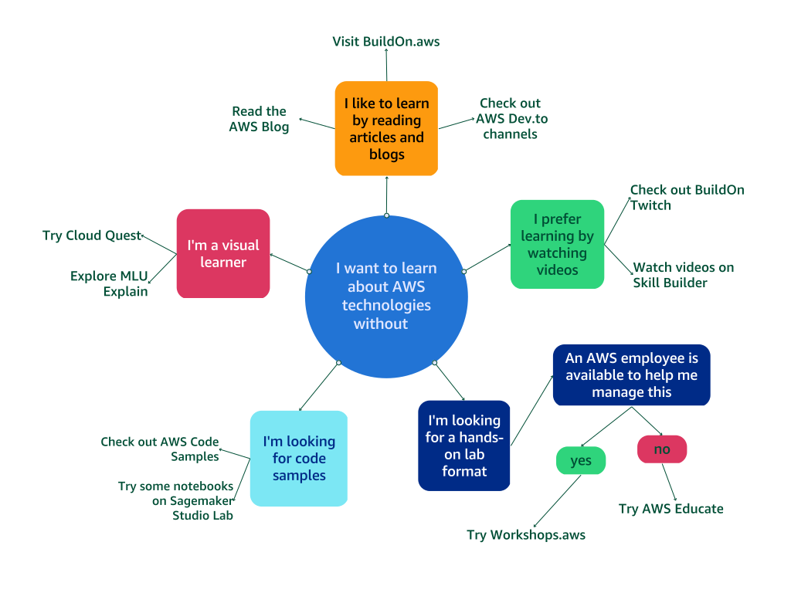

## Welcome to the AWS Cloud Club Learner Library

### This library includes a set of folders where you can discover free, ungated content on AWS properties to further your learning journey. Choose a topic that interests you and visit its homepage in its labelled folder or use the table of contents below. 

> 🎥 Click the image above to learn how to use the Learner Library

Primary among the sites listed in this repo are [AWS Educate](https://www.awseducate.com/), [AWS Skillbuilder](https://explore.skillbuilder.aws/learn) and [AWS Workshops](https://workshops.aws/). Use these platforms to learn more about AWS technologies in a level-appropriate format.

> A note about [AWS Educate](https://www.awseducate.com/): please ensure that you are logged in to Educate before accessing specific resources on that site. You may also need to navigate to a course by applying filters.

### More interesting resources:

- We recommend [AWS Cloud Quest](https://explore.skillbuilder.aws/learn/course/11458/play/42651/play-cloud-quest-cloud-practitioner), a gamified site where you can learn Cloud fundamentals while having fun and building.

- Another excellent resource is [What-Is?](https://aws.amazon.com/what-is/) where you can quickly check definitions of technical terminology in a card format.

| Table of Contents                                              | Description                                                                                                                                                                                                                                                                                                              |
|---------------------------------------------------------------|--------------------------------------------------------------------------------------------------------------------------------------------------------------------------------------------------------------------------------------------------------------------------------------------------------------------------|
| [Artificial Intelligence and Machine Learning](/AI_ML)        | Artificial intelligence refers to the general ability of computers to emulate human thought and perform tasks in real-world environments, while machine learning refers to the technologies and algorithms that enable systems to identify patterns, make decisions, and improve themselves through experience and data. |
| [Containers and Kubernetes](/Containers_Kubernetes)           | A container is a standard unit of software that packages up code and all its dependencies. Kubernetes is a portable, extensible, open source platform for managing containerized workloads and services.                                                                                                                  |
| [Data Science and Data Analytics](/DataScience_DataAnalytics) | Data science is the study of data to extract meaningful insights for business. Data analytics converts raw data into actionable insights.                                                                                                                                                                                |
| [Database](/Database)                                         | A database is an organized collection of structured information, or data, typically stored electronically in a computer system.                                                                                                                                                                                          |
| [Internet of Things](/IoT)                                    | Internet of Things refers to the collective network of connected devices and the technology that facilitates communication between them and the cloud, as well as between the devices themselves.                                                                                                                        |
| [Security](/Security)                                         | IT security is a set of cybersecurity strategies that prevents unauthorized access to organizational assets such as computers, networks, and data.                                                                                                                                                                        |
| [Serverless](/Serverless)                                     | Serverless is a cloud-native development model that allows developers to build and run applications without having to manage servers.                                                                                                                                                                                    |
| [Web and Mobile Development](/Web_Mobile_Development)            | Web development refers to the ability to build beautiful, accessible, fast, and secure websites that work cross-browser for all users.                                                                                                                                                                     |

---

## What Learning Platform Works Best for Me?

### Like all questions in tech, "it depends!" In particular, it depends on how you like to learn. To help you choose the right platform for your learning style, we've created a clickable decision tree. Links are listed below the graphic.

> Useful links:
>
> - [BuildOn.aws blog](https://buildon.aws)
> - [Dev.to for AWS](https://dev.to/aws)
> - [AWS Blog](https://aws.amazon.com/blogs/)
> - [BuildOn Twitch](https://www.twitch.tv/aws)
> - [Skill Builder](https://explore.skillbuilder.aws/)
> - [AWS Educate](https://www.awseducate.com/)
> - [Workshops.aws](https://workshops.aws/)
> - [SageMaker Studio Lab](https://studiolab.sagemaker.aws/)
> - [AWS Code Samples](https://github.com/aws-samples)
> - [Cloud Quest](https://explore.skillbuilder.aws/learn/course/11458/play/42651/play-cloud-quest-cloud-practitioner)
> - [MLU (Machine Learning University) Explain](https://mlu-explain.github.io/)

## Security

See [CONTRIBUTING](CONTRIBUTING.md#security-issue-notifications) for more information.

## License Summary

The documentation is made available under the Creative Commons Attribution-ShareAlike 4.0 International License. See the [LICENSE file](LICENSE.md).

## Code of Conduct

We want the Learner Library to be useful to everyone and welcome PRs and Issues. We expect those who use this repo to abide by our [Code of Conduct](https://aws.github.io/code-of-conduct).
